<h1>Hi There, I'm Tarun </h1>

> Reverse engineering focused security researcher building tools, breaking assumptions, and shipping experiments around AI, pentesting, cybersecurity, software and web protection.

  
  
  
  
  

## About

I mostly work around reverse engineering, cybersecurity, and protection research. I like understanding how real systems behave under pressure: APIs, web protections, client-side checks, automation controls, proxy flows, and security boundaries that are supposed to stop abuse. Alongside that, I experiment with AI development and automation tooling where it helps security research, testing, and data extraction workflows.

## Focus

- Reverse engineering apps, APIs, client-side protections, and security-sensitive flows.
- Pentesting, vulnerability research, cybersecurity notes, and practical bypass-oriented tooling.
- Software protection research, anti-tamper thinking, obfuscation analysis, and protection design.
- Web protection research around API behavior, rate limits, IP bans, automation resistance, and abuse controls.
- AI development experiments where models, automation, and security tooling meet.

## Languages & Tools

<table>
  <tr>
    <td align="center"> JavaScript</td>
    <td align="center"> Python</td>
    <td align="center"> C++</td>
    <td align="center"> Assembly</td>
  </tr>
  <tr>
    <td align="center"> Burp Suite</td>
    <td align="center"> Frida</td>
    <td align="center"> Ghidra</td>
    <td align="center"> IDA Pro</td>
  </tr>
</table>

## GitHub Stats

  <picture>
    <source media="(prefers-color-scheme: dark)" srcset="./profile/stats-dark.svg" />
    <source media="(prefers-color-scheme: light)" srcset="./profile/stats-light.svg" />
    
  </picture>
  <picture>
    <source media="(prefers-color-scheme: dark)" srcset="./profile/streak-dark.svg" />
    <source media="(prefers-color-scheme: light)" srcset="./profile/streak-light.svg" />
    
  </picture>
  

  
  

    <picture>
      <source media="(prefers-color-scheme: dark)" srcset="./profile/top-langs-dark.svg" />
      <source media="(prefers-color-scheme: light)" srcset="./profile/top-langs-light.svg" />
      
    </picture>

## Stargazers

  

## Public Repositories

- [aifiesta-pentesting](https://github.com/encryptarun/aifiesta-pentesting) - Pentesting report of Aifiesta 09/2025.
- [qwen-api](https://github.com/encryptarun/qwen-api) - Qwen API documentation.

## Connect

